## Mi estas hyperfinitism

> *Ĉiuj matematikaj objektoj estas hiperfiniaj.*

### Security Research

R&D engineer in cybersecurity, focusing on **Confidential Computing** / **Trusted Execution Environments (TEE)**.

### Scientific Research

Independent researcher in mathematics, theoretical computer science, and philosophy.
Research interests include:

- **Mathematics**: Mathematical Logic, Nonstandard Mathematics, Topology, Recursion Theory
- **Theoretical Computer Science**: Theory of Computation, Type Theory, Domain Theory, Term Rewriting Systems, Formal Methods
- **Philosophy**: Philosophy of Mathematics, Philosophy of Law, Mathematical Philosophy

### Open Source

Active contributor to open-source software, particularly in the domain of **Hardware-assisted Isolated Execution Environments (HIEE)**, including both TEEs and Trusted Platform Modules (TPM).
Maintainer and developer of security-oriented tooling and libraries.

### Selected Repositories

### GitHub Stats

*Generated by [GitHub Readme Stats](https://github.com/anuraghazra/github-readme-stats) via [GitHub Readme Stats Action](https://github.com/stats-organization/github-readme-stats-action)*
